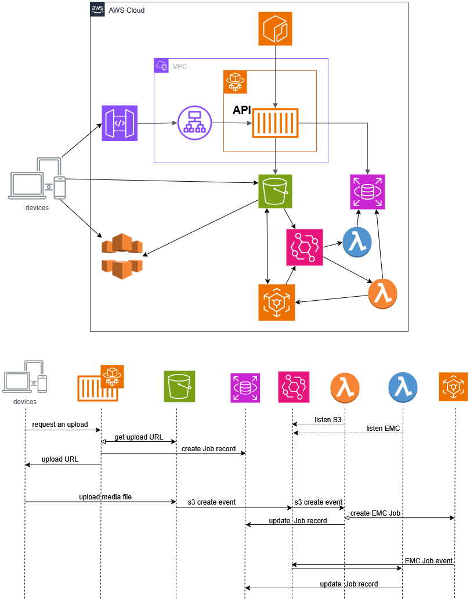

# Example of Test Implementation for AWS API Service

## Service Blueprint

The service implements asynchronous media processing capabilities,
enabling clients to upload media files and receive processed content
through an AWS cloud infrastructure.

**Processing Workflow:**
1. Client requests a media upload link and uploads media files directly to S3 storage
2. The system processes the uploaded media file according to specified processing settings
3. Processed content is then distributed through CloudFront CDN for optimal delivery

## Proof of Concept Implementation

The proof-of-concept implementation focuses on covering the main components
of the media processing pipeline:

1. **API Service** - Handles client requests and responses with upload URLs
2. **S3 Event Processing Lambda** - Handels file upload events in S3 and triggers EMC jobs
3. **EMC Event Processing Lambda** - Handels EMC events and updates Job records
4. **AWS IaC Draft** - Provides the foundational infrastructure template for AWS CloudFormation

### Local Setup and Testing Environment

**Prerequisites:**
- `bash` or `sh` shell environment
- Node Version Manager (`nvm`) with Node.js installed
- Docker Compose for builds and local testing

**Setup Process:**

Execute the `init.sh` script to install all necessary dependencies
and configure the local development environment.

Run the `build.sh` script to build and package all artifacts:
- `api-service:latest` - Local Docker image containing the API service
- `mock-emc:latest` - Local Docker image with EMC mock
- `test/local/s3event.zip` - S3 event processing Lambda
- `test/local/emcEvent.zip` - EMC event processing Lambda

**Running Local Tests:**

1. Navigate to the `test/local` directory
2. Execute Docker Compose to spin up all containerized services and wait for the aws-init container to complete its initialization process
3. Run API and happy path tests using `npm test`

### AWS Deployment

**WIP**
